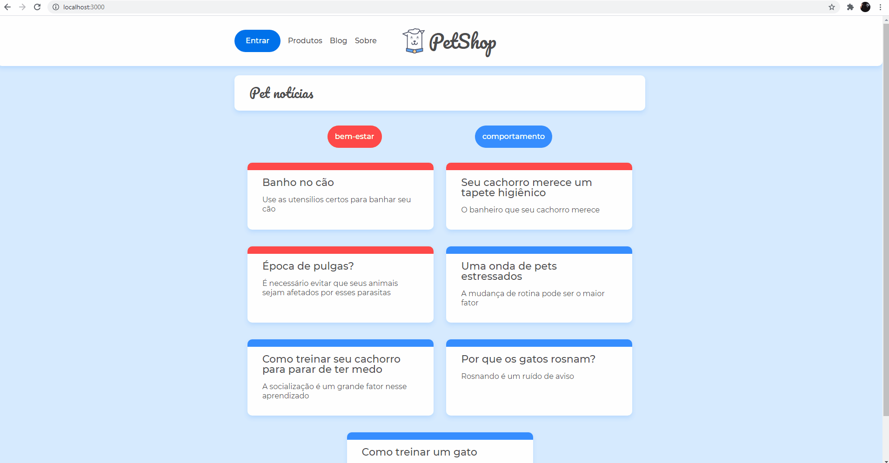

<h1 style="text-align: center;">Petshop Blog</h1>

<h2>Descrição</h2>

Projeto desenvonvido durante <a href="https://cursos.alura.com.br/course/react-router-navegacao-spa">curso de React-Router</a> juntamente com instrutor <a href="https://github.com/felipedotcom">Felipe Nascimento</a>

<h2>Objetivo</h2>

O objetibo deste projeto é utilizar axios para consumir dados de uma api e a biblioteca React-Router-Dom para fazemos a nevegação em nossa single page!

<h2>Como Utilizar</h2>

Ao clonar este repositório rode em seu programa <code>npm i</code>, que será responsável por carregar a pastya node_modules com todas as dependências necessárias. Será necessário ter node instalado em sua máquina! Para carregar os dados estamos utilizando json-server que disponibilizará os dados do arquivo db.json com <code>npx json-server --watch db.json --port 5000</code> que disponibilizará os dados na porta 5000. Para startar o aplicativo react rode <code>npm start</code>, que ficará ocupando a porta 3000

